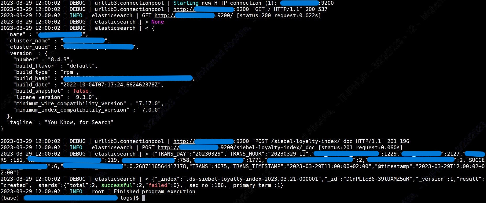
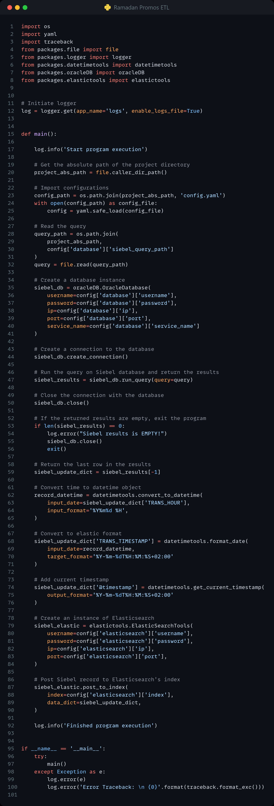

[![LinkedIn][linkedin-shield]][linkedin-url]

<!-- PROJECT LOGO -->
 

    
  <h3 align="center">Ramadan ETL to Elasticsearch</h3>

<!-- TABLE OF CONTENTS -->

  
Table of Contents

  <ol>
    <li>
      <a href="#about-the-project">About The Project</a>
      <ul>
        <li><a href="#business-case">Business Case</a></li>
        <li><a href="#technical-solution">Technical Solution</a></li>
        <li><a href="#screenshots">Screenshots</a></li> <!-- Only if present -->
        <li><a href="#tech-stack">Tech Stack</a></li>
      </ul>
    </li>
    <li><a href="#contact">Contact</a></li>
  </ol>

<!-- ABOUT THE PROJECT -->
## About The Project

* **Project Name:** Ramadan ETL to Elasticsearch  
* **Version:** v1.0.0  
* **Department:** Technology

---

### Business Case

This project automates the extraction, transformation, and loading (ETL) of data related to Ramadan promotions from the Siebel database into Elasticsearch. The goal is to centralize and streamline the analysis of promotional data, excluding the Promo Engine on Splunk.

By automating this ETL process, the data from Siebel is formatted and consolidated into Elasticsearch, allowing for easy access and analysis via Kibana in a unified dashboard. This ensures comprehensive monitoring and performance tracking of all Ramadan promotions in near real-time.

(<a href="#readme-top">back to top</a>)

### Technical Solution

The ETL process is scheduled to run hourly and perform the following steps:
* **Extract:** Pulls Ramadan promotion data from the Siebel database.
* **Transform:** Processes and transforms the extracted data to match the format required by Elasticsearch.
* **Load:** Loads the processed data into the designated Elasticsearch index, `siebel-test-index-000001`.

The resulting consolidated data is available for in-depth analysis via Kibana, enabling efficient decision-making and promotional tracking.

(<a href="#readme-top">back to top</a>)

### Screenshots

(<a href="#readme-top">back to top</a>)

### Tech Stack

This project was developed using the following tech stack:

* **Python**
* **SQL**

(<a href="#readme-top">back to top</a>)

<!-- CONTACT -->
## Contact

Mohamed AbdelGawad Ibrahim - [@m-abdelgawad](https://www.linkedin.com/in/m-abdelgawad/) - <a href="tel:+201069052620">+201069052620</a>

(<a href="#readme-top">back to top</a>)

<!-- MARKDOWN LINKS & IMAGES -->
[linkedin-shield]: https://img.shields.io/badge/-LinkedIn-black.svg?style=for-the-badge&logo=linkedin&colorB=555
[linkedin-url]: https://www.linkedin.com/in/m-abdelgawad/
